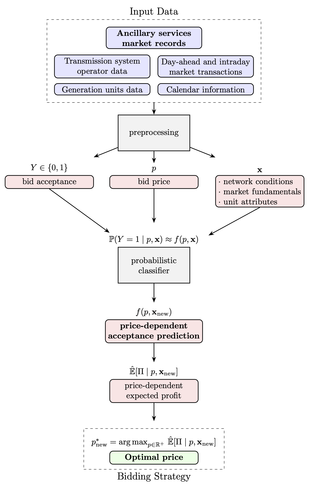

# asm_forecast

_Strategic bidding in pay-as-bid power reserve markets: A machine learning approach_

<p align="center">
  
</p>

This file contains the instructions to reproduce the analysis and results of the related [paper](https://doi.org/10.1016/j.eneco.2025.108780). It is assumed that users have Python 3.11 and R 4.3 or higher installed on their system. The pipeline is composed of notebooks (except one R script) that must be executed in a specific order, and sometimes several times with different parameter values. The execution times are indicative and correspond to a MacBook Pro with an Apple M2 Pro chip and 16GB of RAM. Reproducing the whole analysis corresponds to a global running time around 10h. I/O operations assume an SSD on which at least 55GB of space is available.

## Set-up
### Create Python virtual environment
Run the following command in your terminal:
```{bash}
python3 -m venv asm_forecast
```
This creates a virtual environment named `asm_forecast` in the current directory.

### Activate virtual environment
```{bash}
source asm_forecast/bin/activate
```
Once activated, your terminal prompt will indicate that the virtual environment is active (e.g., it might look like `(asm_forecast)`)

### Install packages from `requirements.txt`
```{bash}
pip install -r requirements.txt
```
This installs all the packages listed in `requirements.txt` into the virtual environment.


## Process data

### Structural data

Run notebook `processing/StructuralDataAnalysis.ipynb` (execution time <1m)

_Input_: Raw structural data `data/1_input/1_DatiStrutturali/DatiStrutturali_1822_float.xlsx`

_Output_: Principal component scores `data/2_processed/PC_strut.pickle`

### Exogenous, calendar, market data and create consolidated dataset

Run notebook `ML_dataset_construction.ipynb` (execution time <5m)

_Inputs_:
- Structural data `data/2_processed/PC_strut.pickle`
- Exogenous and calendar data: `data/1_input/2_exogenous_and_calendar/Dati_per_data_1722.xlsx`
- Generating units (GUs) data: `data/1_input/3_market/Dati_per_unita.xlsx`
- Market data: `data/1_input/3_market/MSD_bids_with_program.parquet`

_Outputs_: 
- Downward bids dataset: `data/2_processed/ML_dataset_BID.{pkl, csv}`
- Upward bids dataset:`data/2_processed/ML_dataset_OFF.{pkl, csv}`


## Train and test model

### Benchmark models

#### Historical prices

Run notebook `modeling/benchmark_models/HistoricalPrices.ipynb` (execution time <1m) two times, one with `scope` parameter set to `'OFF'` (upward bids) and one with `scope` parameter set to `'BID'` (downward bids)

_Input_: Bids dataset: `data/2_processed/ML_dataset_{scope}.pkl`

_Output_: HPrecal predictions: `modeling/{scope}/model_predictions/HP_predicted_probs_monthly_recal_rolling_12m.pkl`

#### Logistic Regression

Run R script `modeling/benchmark_models/GLM_bernoulli.R` **(execution time ~1h)** two times, one with `scope` parameter set to `'OFF'` (upward bids) and one with `scope` parameter set to `'BID'` (downward bids)

_Input_: Bids dataset `data/2_processed/ML_dataset_{scope}.pkl`

_Output_: GLMrecal predictions `modeling/{scope}/model_predictions/GLM_predicted_probs_monthly_recal_rolling_12m.pkl'`

### Main (random forest) model

#### Train and test model on specific years
Run notebook `modeling/ModelTrainTest.ipynb` (execution time <5m) for each `scope`, and for each `train_year` in `[2018, 2019, 2020, 2021]`

_Input_: Bids dataset `data/2_processed/ML_dataset_{scope}.pkl`

_Outputs_:
- RF{year} predictions `modeling/{scope}/model_predictions/RF_predicted_probs_train_{train_years}_test_{test_years}.pkl`
- RF{year} model `modeling/{scope}/model_dumps/model_trained_{train_years}_{test_years}.joblib`

#### Train and test model with monthly recalibration

Run notebook `modeling/ModelTrainTestRecalibration.ipynb` **(execution time ~2h)** for each `scope`

_Input_: Bids dataset `data/2_processed/ML_dataset_{scope}.pkl`

_Outputs_:
- RFrecal predictions `modeling/{scope}/model_predictions/RF_predicted_probs_monthly_recal_rolling_12m.pkl`
- RFrecal monthly snapshot models `modeling/OFF/model_dumps/classifier/YYYYMM.joblib`

### Compare performances of model vs benchmarks

Run notebook `modeling/ModelVsBenchmarks.ipynb` (execution time <30s) for each `scope`

_Inputs_:
- Bids dataset `data/2_processed/ML_dataset_{scope}.pkl`
- RF predictions for static models (trained on specific years) `modeling/{scope}/model_predictions/RF_predicted_probs_train_{year}_test_{test_years}.pkl`
- RF predictions with monthly recalibration `modeling/{scope}/model_predictions/RF_predicted_probs_monthly_recal_rolling_12m.pkl`
- GLM predidctions with monthly recalibration `modeling/{scope}/model_predictions/GLM_predicted_probs_monthly_recal_rolling_12m.csv`
- HP predidctions with monthly recalibration `modeling/{scope}/model_predictions/HP_predicted_probs_monthly_recal_rolling_12m.pkl`

_Outputs_:
- **Figure 3** `plots/{scope}/models_comparison/RFrecal_GLMrecal_HPrecal_aps_year_{scope}.png`
- **Figure 4** `plots/{scope}/models_comparison/RF2018_RF2019_RF2020_RF2021_RFrecal_aps_year_{scope}.png`

## Post-process model predictions

### Calibrate probabilities and evaluate binary predictions

Run notebook `modeling/ModelPerformanceAnalysis.ipynb` (execution time <30s) for each `scope`

_Inputs_:
- Bids dataset `data/2_processed/ML_dataset_{scope}.pkl`
- RF predictions (with monthly recalibration) `modeling/{scope}/model_predictions/RF_predicted_probs_monthly_recal_rolling_12m.pkl`

_Outputs_:
- RF _calibrated_ probabily predictions `modeling/{scope}/model_predictions/RF_predicted_probs_monthly_recal_rolling_12m_CALIBRATED.pkl`
- Fitted isotonic regression models for each month `{scope}/model_dumps/calibrator/YYYYMM.joblib`
- **Figure 5** `plots/{scope}/rd_{scope}.png`
- **Figure 6** `plots/{scope}/precision_recall/prf1_{scope}.png`

### Explain model

Run notebook `modeling/ModelExplainer.ipynb` (execution time <5m) for each `scope`

_Inputs_:
- Bids dataset `data/2_processed/ML_dataset_{scope}.pkl`
- RF model trained on 2021 `modeling/{scope}/model_dumps/model_trained_{scope}_2021.joblib`

_Outputs_:
- **Figure 7** `plots/{scope}/explainer/shap_{scope}_feature_imp_static.png`
- **Figure 8** `plots/{scope}/explainer/shap_{scope}_feature_imp.png`
- **Figure 9** `plots/{scope}/explainer/pfi_{scope}_test.png`
- **Figure 10** `plots/{scope}/explainer/shap_{scope}_dependence_PriceDiff.png`
- **Figure 11** `plots/{scope}/explainer/shap_{scope}_dependence_BP.png`
- **Figure 12** `plots/{scope}/explainer/shap_{scope}_dependence_Qty.png`
- **Figure 13** `plots/{scope}/explainer/shap_{scope}_dependence_Prov.png`

## Bid pricing use case and market simulation

Run notebook `BidPricing.ipynb` (execution time <20m) for each `scope`

_Inputs_:
- Bids dataset `data/2_processed/ML_dataset_{scope}.pkl`
- RF model trained on 2021 `modeling/{scope}/model_dumps/model_trained_{scope}_2021.joblib`
- Fitted isotonic regression models for each month `{scope}/model_dumps/calibrator/YYYYMM.joblib`
- RFrecal monthly snapshot models `modeling/OFF/model_dumps/classifier/YYYYMM.joblib`
- Day-ahead bid prices `data/1_input/mgp_bid_prices/mgp_bid_prices.pkl`


_Outputs_:
- Optimal prices for each bid in the test period `data/3_output/optimal_prices_{unit}.pkl`
- **Figure 8** `plots/{scope}/pricing/{bid_id}.png`
- **Figure 9** `plots/{scope}/pricing/profits_strategies_{scope}.png`
- **Table 4** `data/3_output/estimated_profits_{scope}.csv`


